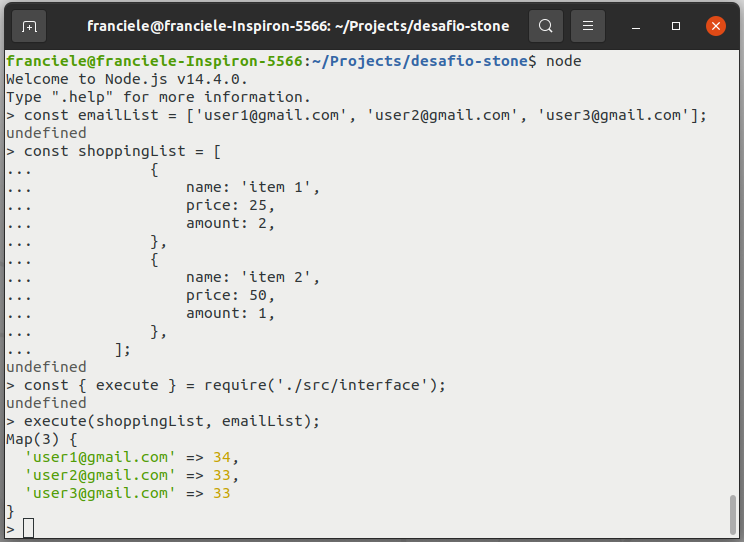

# desafio-stone

## Instalação

Instalar as dependências:
```
npm install
```

## Rodar projeto

### REPL

- Importe a função _execute_ do arquivo _src/interface.js_;
- Passe a lista de compras e a lista de e-mails respectivamente.

Observe o exemplo abaixo.



### Para rodar o projeto inserindo os dados de entrada hard coded:
- Acesse _src/main.js_.
- Edite as listas shoppingList e emailList. Elas possuem um valor exemplo.
- Execute: 

```
node src/main.js
```

### Para rodar o projeto inserindo os dados de entrada através de arquivos CSV:

Na pasta _data_, existem dois arquivos csv com valores de exemplo.

- _data/email_list.csv_: Lista de e-mails.
- _data/shopping_list.csv_: Lista de compras. Cada linha possui o nome do item, preço e quantidade respectivamente.

Considerando as informações anteriores:

- Edite os arquivos _email_list.csv_ e _shopping_list.csv_. Não é necessário inserir header.
- Execute:

```
node src/mainWithDataInputByCsvFile.js
```

## Testes

Rodar testes:
```
npm run test
```
Cobertura dos testes: 100%
```
npm run test-coverage
```

File          | % Stmts | % Branch | % Funcs | % Lines | Uncovered Line #s 
--------------|---------|----------|---------|---------|-------------------
All files     |     100 |      100 |     100 |     100 |                   
 core.js      |     100 |      100 |     100 |     100 |                   
 interface.js |     100 |      100 |     100 |     100 |                   


## Documentação do código

Gerar documentação:
```
npm run jsdoc
```
Para acessar a documentação web, abra _out/index.html_.

## Arquitetura

Arquitetura Clean.
